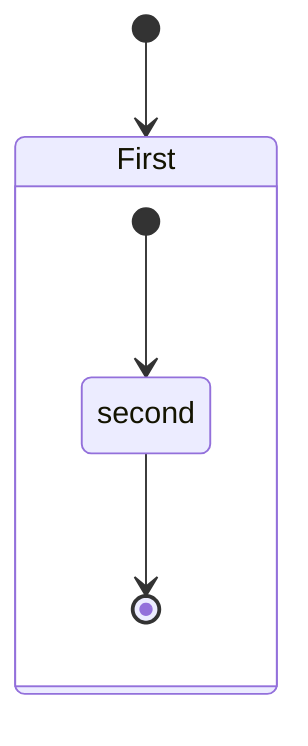

---
### vBox Inventory
| vm Name        | hostname                      |   IP Address    | dns |
|------------    | -----------------------       |-----------------| ----|
|freeipaserver   | ipaserver.freeipa.local       |192.158.56.101, 10.0.2.15 | 127.0.0.1 |
|freeipaclient01 | freeipaClient01.freeipa.local |192.168.56.110, 10.0.2.15 | 10.0.2.3 |
|freeipaClient02 | freeipaClient02.freeipa.local |192.168.56.120, 10.0.2.15 | 10.0.2.3 |
|ipareplica01    | ipareplica01.freeipa.local    |192.168.56.102, 10.0.2.15 | 10.0.2.3 |
| | | |
### Ports used

---

Passwords:
- admin: Ca11ista
- ptrujillo: Ca11ista
- pablito: tutp610125
---
### Sources
* [Install freeIPA server very well explained](https://blog.christophersmart.com/articles/freeipa-how-to-fedora/)
* [FreeIPA: Identity/Policy Management](https://docs.fedoraproject.org/en-US/Fedora/18/html/FreeIPA_Guide/index.html)
* [How to setup a DNS server with bind](https://fedoramagazine.org/how-to-setup-a-dns-server-with-bind/)
* [Free IPA step by step use carefully](https://fedoraproject.org/wiki/FreeIPA_step_by_step)
* [Installing IPA Client on Linux](https://docs.fedoraproject.org/en-US/Fedora/18/html/FreeIPA_Guide/Installing_the_IPA_Client_on_Linux.html)
* [Configure NTP server](https://www.server-world.info/en/note?os=Fedora_35&p=ntp&f=1)
* [Configure Firewall](https://access.redhat.com/documentation/en-us/red_hat_enterprise_linux/7/html/security_guide/sec-working_with_zones)
* [Configure IPA Client base to Vagrant client](https://www.server-world.info/en/note?os=Fedora_20&p=ipa&f=2)
* [Fedora 35 Manual](https://www.server-world.info/en/note?os=Fedora_35)
## Fedora server
[download fedora 35 server ISO](https://getfedora.org/en/server/download/)

## freeIPA
### Install freeIPA server
````bash
yum update
dnf install vim rsync   # optional
# install freeIPA requirements
dnf install @freeipa-server oddjob-mkhomedir

````

### DNS Configuration
  Use dig command to trace dns resolv, dig google.com

#### Add client to dns
````bash
dns is using port 53
sudo dnf install bind-utils -y
sudo vi /etc/resolv.conf
# name server should have the dnsserver ip
# nameserver 192.168.56.111

# review changes and make the file inmutable to prevent overwritten
sudo chattr +i /etc/resolv.conf
````
Test changes
> dig fedoramagazine.org

````bash
; <<>> DiG 9.16.24-RH <<>> fedoramagazine.org
;; global options: +cmd
;; Got answer:
;; ->>HEADER<<- opcode: QUERY, status: REFUSED, id: 52508
;; flags: qr rd; QUERY: 1, ANSWER: 0, AUTHORITY: 0, ADDITIONAL: 1
;; WARNING: recursion requested but not available

;; OPT PSEUDOSECTION:
; EDNS: version: 0, flags:; udp: 1232
; COOKIE: 3d2494dd1b270dc80100000061deeb9b797cf153b335f033 (good)
;; QUESTION SECTION:
;fedoramagazine.org.            IN      A

;; Query time: 5 msec
;; SERVER: 192.168.56.111#53(192.168.56.111)
;; WHEN: Wed Jan 12 14:54:19 UTC 2022
;; MSG SIZE  rcvd: 75

````
## Firewall
IPA needs following ports enabled
### open ports

|    Name    | Port                | Purpose  |
|------------| --------------------| ---------|
| HTTP/HTTPS | 80 / 443 TCP        | WebUI and IPA CLI admin tools communication. |
| LDAP/LDAPS | 389 / 636 TCP       | directory service communication. |
| Kerberos   | 88 /464 TCP and UDP | communication for authentication |
| DNS        | 53 TCP and UDP      | nameservice, used also for autodiscovery, autoregistration and High Availability Authentication(sssd), optional |
| NTP | 123 UDP | network time protocol, optional |
| kadmind     | 464 / 749 TCP | used for principal generation, password changes etc. |
| | | |
## NetWorking
When installing fediora from a DVD there is no way to set static IP using VB interface, instead you have to
1. Assign a NAT network
2. assign a HostOnly network with DHCP disabled, here I pick network 8 with ip 169.254.10.26
3. get the driver using ip a

````bash
ip a
; <<>> enpos08
;; ->>HEADER<<- enpos08
inet 192.168.3.256
copy the full output here
````
4. Create a file called ifcfg-enp0s8 in /etc/sysconfig/network-scripts/ and give it the following contents: 169.254.10.26
````
DEVICE=enp0s8
BOOTPROTO=static
ONBOOT=yes
IPADDR=192.168.99.10
NETMASK=255.255.255.0
````
5. restart NetworkManager
> systemctl restart NetworkManager
>
[source for above](https://marcus.4christies.com/2019/01/how-to-create-a-virtualbox-vm-with-a-static-ip-and-internet-access/)  
[enable network using NetworkManager nmcli](https://linuxhint.com/configure-static-ip-address-fedora/)

#### Open Ports commands (Method 1)
````bash
for i in 80 443 389 636 88 464 ; do firewall-cmd --add-port=$i/tcp --permanent; done
for i in 88 464 123; do firewall-cmd --add-port=$i/udp --permanent; done
````
### Open Ports commands (Method 2)
````bash
for x in dns freeipa-ldap freeipa-ldaps freeipa-replication; do firewall-cmd --permanent --zone=public --add-service=${x} ; done
````
[todo] Why service DNS (port 53) is not in the command

to verify firewall zones:
> firewall-cmd --get-active-zones
to review ports opened
> firewall-cmd --zone=public --list-all

With Fedorsa Server Version should show FedoraServer as default zone


## Administration
 define http address in notepad C:\Windows\System32\drivers\etc\hosts

 [free IPA Local Server](http://ipaserver.freeipa.local)

#### Installing IPA client on Linux
[Installing IPA Client on Linux](https://docs.fedoraproject.org/en-US/Fedora/18/html/FreeIPA_Guide/Installing_the_IPA_Client_on_Linux.html)

* yum install freeipa-client freeipa-admintools
Install ipa client
- ipa-client-install --enable-dns-updates  (option valid only if server was installed using dns)


### Add DNS zone
  [add DNS zones](https://blog.khmersite.net/2020/12/freeipa-adding-new-dns-record/)
#### see the existing dns zone
ipa dnszone-find
````
Active zone: TRUE
  Authoritative nameserver: ipaserver.freeipa.local.
  Administrator e-mail address: hostmaster.freeipa.local.
  SOA serial: 1642549583
  SOA refresh: 3600
  SOA retry: 900
  SOA expire: 1209600
  SOA minimum: 3600
  BIND update policy: grant FREEIPA.LOCAL krb5-self * A; grant FREEIPA.LOCAL krb5-self * AAAA; grant FREEIPA.LOCAL
                      krb5-self * SSHFP;
  Dynamic update: TRUE
  Allow query: any;
  Allow transfer: none;
----------------------------
Number of entries returned 1
````
#### Create new dns record for clients
> ipa dnsrecord-add freeipa.local. ipaclient02 --a-rec 192.168.56.120
````
  Record name: ipaclient02
  A record: 192.168.56.120
````
> ipa dnsrecord-add freeipa.local. ipaclient01 --a-rec 192.168.56.110
````
  Record name: ipaclient02
  A record: 192.168.56.120
````


#### Create Users
- ipa user-add
- ipa user-mod pablito --password

#### create user home dir
````bash
mkdir -m0750 -p /home/ptrujillo
mkdir -m0750 -p /home/admin

chown XXXXXXXX:XXXXXXXX /home/ptrujillo/
where XXXXXXXX is the UID located in the freeipa dashboard Identity.Users guid
````


### authselect command old authconfig


