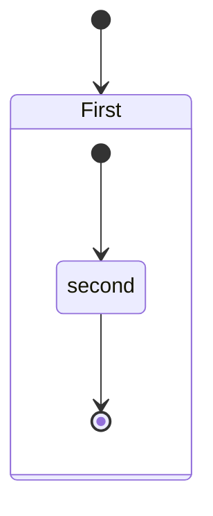

---
### vBox Inventory
| vm Name        | hostname                |   IP Address    |
|------------    | ----------------------- |-----------------|
| freeipaserver  | server.freeipa.local     | 192.168.56.101 |
| freeipaclient1 | client1.freeipa.local    | 192.168.56.102 |
| ipaDNSserver   | dns01.freeipa.local      | 192.168.56.111 |
| ipaDNSclient   | dnsclient1.freeipa.local | 192.168.56.114 |
| | |
---
### Sources
* [FreeIPA: Identity/Policy Management](https://docs.fedoraproject.org/en-US/Fedora/18/html/FreeIPA_Guide/index.html)
* [How to setup a DNS server with bind](https://fedoramagazine.org/how-to-setup-a-dns-server-with-bind/)
* [Free IPA step by step use carefully](https://fedoraproject.org/wiki/FreeIPA_step_by_step)
* [Installing IPA Client on Linux](https://docs.fedoraproject.org/en-US/Fedora/18/html/FreeIPA_Guide/Installing_the_IPA_Client_on_Linux.html)
* [Configure NTP server](https://www.server-world.info/en/note?os=Fedora_35&p=ntp&f=1)
* [Configure Firewall](https://access.redhat.com/documentation/en-us/red_hat_enterprise_linux/7/html/security_guide/
* sec-working_with_zones)
## freeIPA
### DNS Configuration
  Use dig command to trace dns resolv, dig google.com

#### Add client to dns
````bash
dns is using port 53
sudo dnf install bind-utils -y
sudo vi /etc/resolv.conf
# name server should have the dnsserver ip
# nameserver 192.168.56.111

# review changes and make the file inmutable to prevent overwritten
sudo chattr +i /etc/resolv.conf
````
Test changes
> dig fedoramagazine.org

````bash
; <<>> DiG 9.16.24-RH <<>> fedoramagazine.org
;; global options: +cmd
;; Got answer:
;; ->>HEADER<<- opcode: QUERY, status: REFUSED, id: 52508        
;; flags: qr rd; QUERY: 1, ANSWER: 0, AUTHORITY: 0, ADDITIONAL: 1
;; WARNING: recursion requested but not available

;; OPT PSEUDOSECTION:
; EDNS: version: 0, flags:; udp: 1232
; COOKIE: 3d2494dd1b270dc80100000061deeb9b797cf153b335f033 (good)
;; QUESTION SECTION:
;fedoramagazine.org.            IN      A

;; Query time: 5 msec
;; SERVER: 192.168.56.111#53(192.168.56.111)
;; WHEN: Wed Jan 12 14:54:19 UTC 2022
;; MSG SIZE  rcvd: 75

````


### Administration
 define http address in notepad C:\Windows\System32\drivers\etc\hosts

 [free IPA Local Server](http://ipaserver.freeipa.local)
 user: admin  Pwd: tutp610125

#### Installing IPA client on Linux
[Installing IPA Client on Linux](https://docs.fedoraproject.org/en-US/Fedora/18/html/FreeIPA_Guide/Installing_the_IPA_Client_on_Linux.html)

* yum install freeipa-client freeipa-admintools
Install ipa client 
- ipa-client-install --enable-dns-updates
  

#### Create Users
- ipa user-add

### authselect command old authconfig


